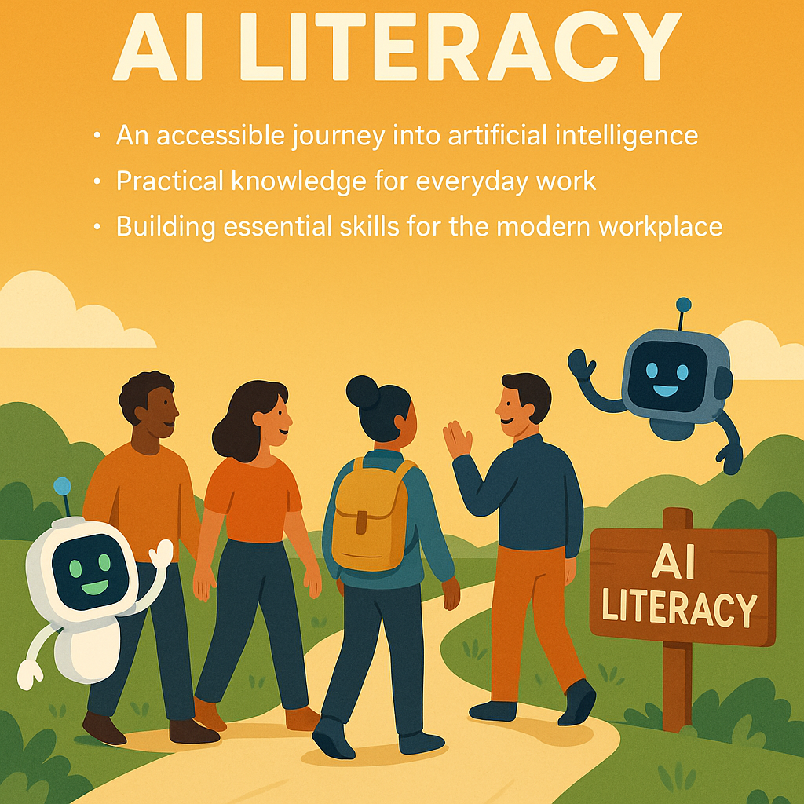
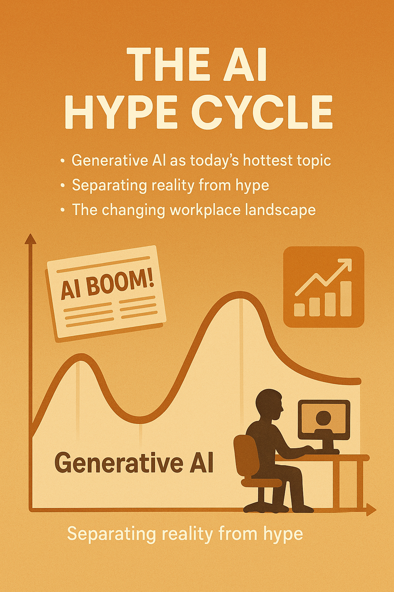
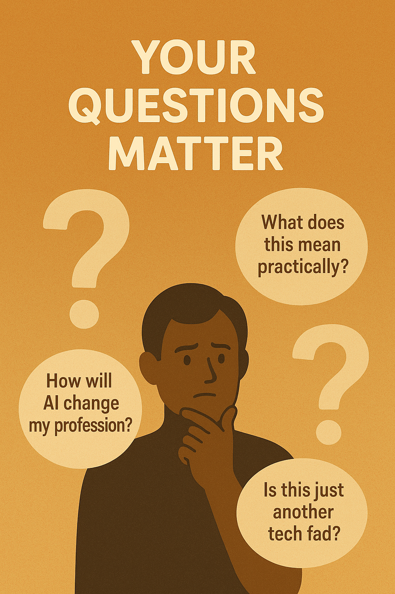
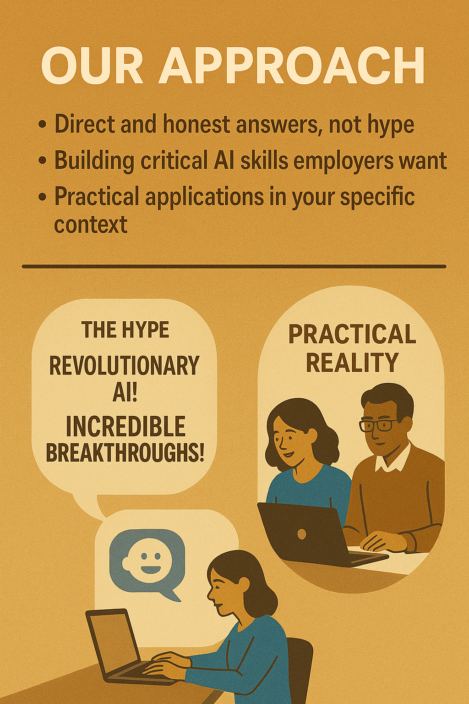
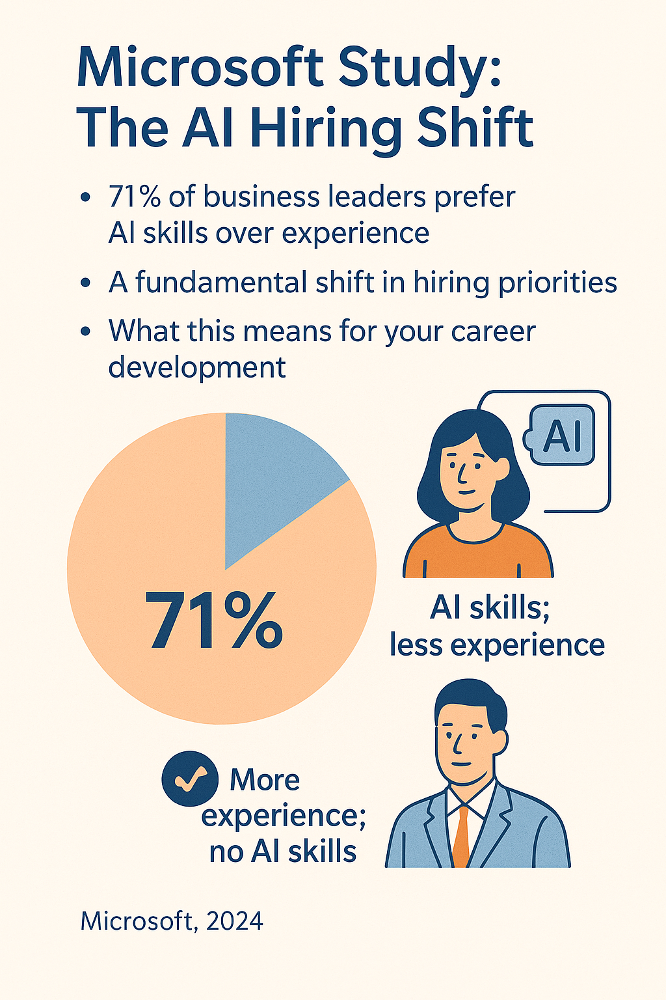
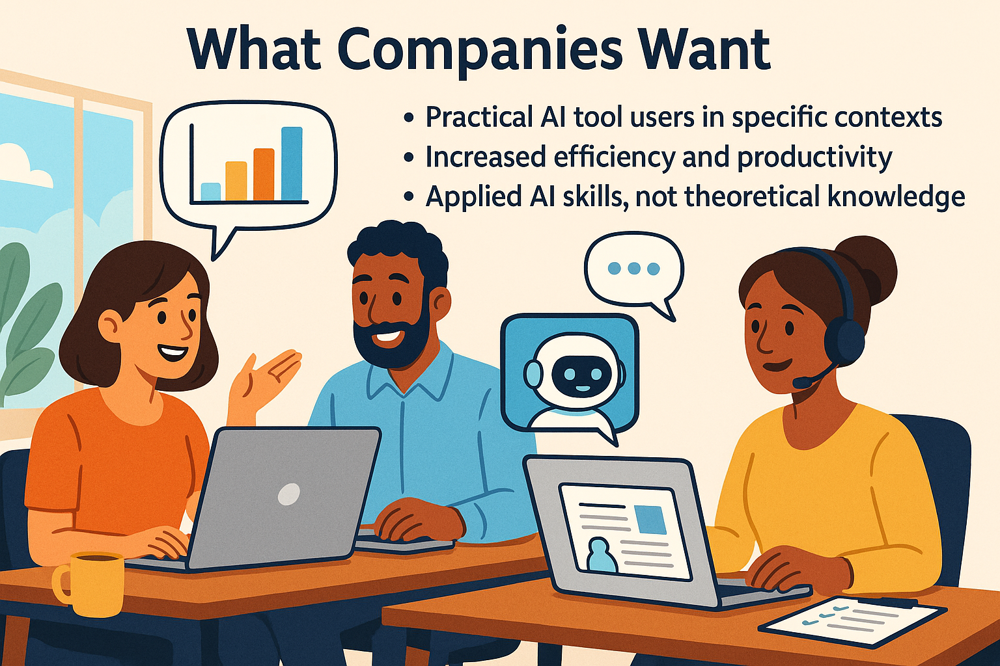
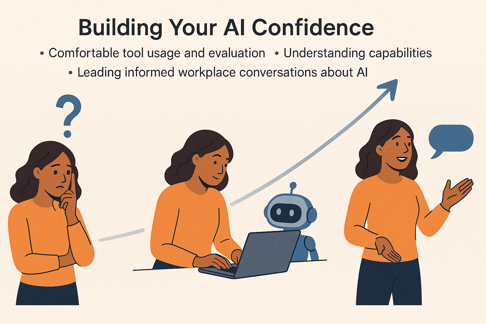
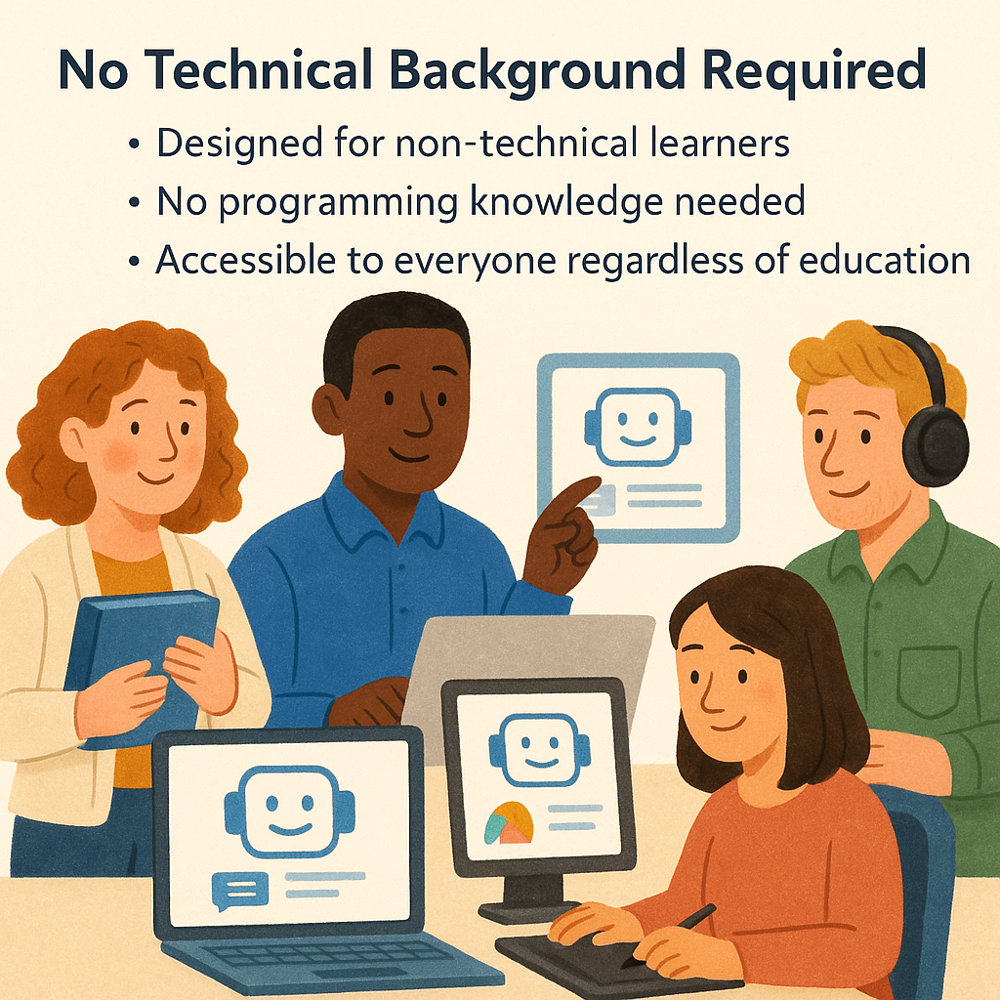
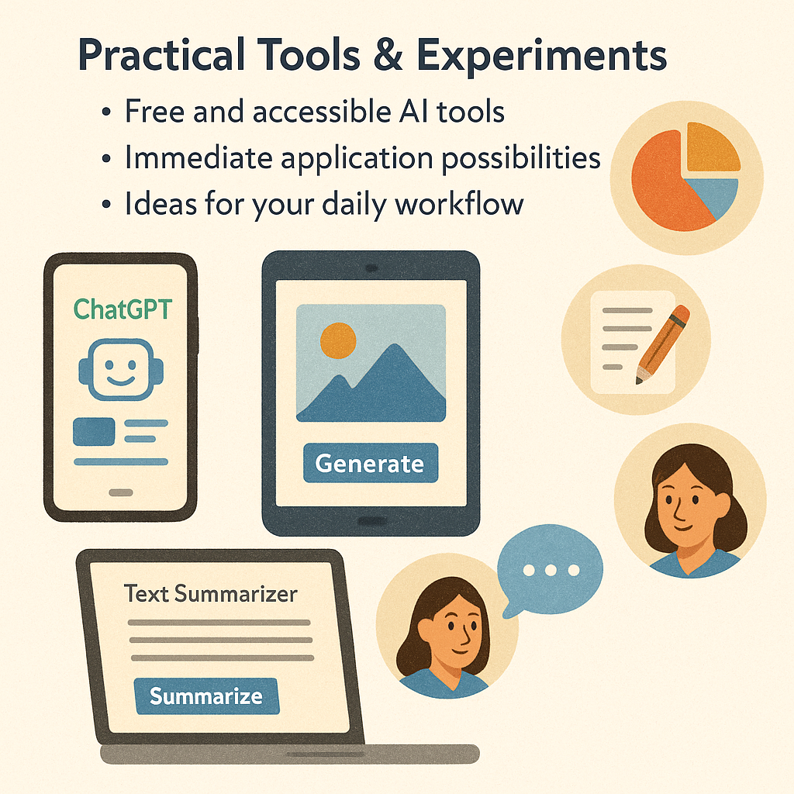
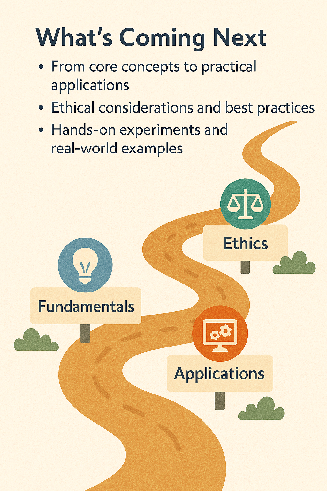

=========

<!-- SLIDE 1 -->
<!-- 
# Welcome to AI Literacy
* An accessible journey into artificial intelligence
* Practical knowledge for everyday work
* Building essential skills for the modern workplace
-->
<!-- 
A warm, inviting illustration showing diverse people beginning a journey on a path labeled "AI Literacy," with friendly AI assistants welcoming them - conveying an approachable start to learning about artificial intelligence.
-->

Здравейте и добре дошли в първия урок на курса ни по AI грамотност. Днес започваме едно увлекателно пътешествие в света на искуствения интелект. 

Ако искате да научите за изкуствения интелект по начин, който е достъпен и разбираем, то вие сте на правилното място. В този курс ще разгледаме основите на генеративния AI и как той може да бъде полезен в ежедневната ви работа.

<!-- SLIDE 2 -->
<!-- 
# The AI Hype Cycle
* Generative AI as today's hottest topic
* Separating reality from hype
* The changing workplace landscape
-->
<!-- 
A visual representation of the "hype cycle" with generative AI at its peak, showing media headlines, trending graphs, and workplace transformation - illustrating both the excitement and exaggerated expectations surrounding AI technologies.
-->

Към днешна дата вероятно вече сте наясно, че генеративният изкуствен интелект е изключително гореща тема. Честно казано, около него има доста шум и свръхочаквания. Може би сте чували, че генеративният AI променя работната среда, вклюючително, може би и вашата собствена.

<!-- SLIDE 3 -->
<!-- 
# Your Questions Matter
* "How will AI change my profession?"
* "What does this mean practically?"
* "Is this just another tech fad?"
-->
<!-- 
A thoughtful illustration showing a person surrounded by floating question marks about AI, each representing common concerns about artificial intelligence's impact on careers and daily work - validating the audience's natural curiosity and concerns.
-->

Когато чуете подобни твърдения, е нормално да възникнат много въпроси: "Как точно генеративният AI ще промени моята професия и как мога да се адаптирам?", "Какво да правя с тази информация?", "Какво означава на практика това, че AI ще промени работните места?". А някои от вас може би дори си мислят: "Това просто поредният хайп ли е? Наистина ли трябва да ме интересува?". Всички тези въпроси са напълно основателни.

<!-- SLIDE 4 -->
<!-- 
# Our Approach
* Direct and honest answers, not hype
* Building critical AI skills employers want
* Practical applications in your specific context
-->
<!-- 
A clear, straightforward visual showing a contrast between exaggerated AI claims (represented by flashy headlines) versus practical reality (represented by people using AI tools effectively in workplace settings) - illustrating the course's grounded approach.
-->

В този курс няма да се поддаваме на преувеличения и хайп. Ще отговорим на тези въпроси директно и честно, но ще отидем и много по-далеч. Защото моята цел е да ви помогна да изградите онези критични умения за работа с изкуствен интелект, които работодателите активно търсят.

<!-- SLIDE 5 -->
<!-- 
# Microsoft Study: The AI Hiring Shift
* 71% of business leaders prefer AI skills over experience
* A fundamental shift in hiring priorities
* What this means for your career development
-->
<!-- 
An infographic highlighting the Microsoft 2024 study results, showing 71% of business leaders preferring candidates with AI skills and less experience over those with more experience but no AI skills - visualizing the dramatic shift in employer preferences.
-->

Едно проучване на Майкрософт от 2024 година показва нещо наистина интересно – 71% от бизнес лидерите споделят, че биха предпочели да наемат човек с умения за работа с AI и по-малко опит, отколкото кандидат без такива умения, но с повече професионален опит. Това е огромна промяна в нагласите!

<!-- SLIDE 6 -->
<!-- 
# What Companies Want
* Practical AI tool users in specific contexts
* Increased efficiency and productivity
* Applied AI skills, not theoretical knowledge
-->
<!-- 
A workplace scene showing professionals using AI tools effectively in various roles (marketing, customer service, administration, etc.), with visible productivity improvements - representing how companies want employees to apply AI in real work situations.
-->

Какво означава това на практика? Означава, че компаниите търсят хора, които знаят как да използват инструментите на генеративния AI в контекста на своята работа, за да увеличат ефективността и продуктивността си. И точно за това ще говорим в следващите уроци.

<!-- SLIDE 7 -->
<!-- 
# Building Your AI Confidence
* Comfortable tool usage and evaluation
* Understanding capabilities and limitations
* Leading informed workplace conversations about AI
-->
<!-- 
A progression illustration showing a person's journey from uncertainty to confidence with AI tools, moving from hesitant exploration to skilled application - representing the confidence-building journey this course offers.
-->

Искам да изградя вашата увереност в използването на тези технологии. След като изслушате поредицата, ще се чувствате много по-комфортно при работа с тези инструменти, при оценяването на техните възможности и ограничения, и ще можете да водите информирани разговори на вашето работно място за генеративния AI – как да използвате тези технологии и какви са етичните последици от тяхното използване.

<!-- SLIDE 8 -->
<!-- 
# No Technical Background Required
* Designed for non-technical learners
* No programming knowledge needed
* Accessible to everyone regardless of education
-->
<!-- 
A diverse group of people from different professional backgrounds (teacher, office worker, creative professional, etc.) interacting with simple AI interfaces - illustrating that the course is designed for everyone, not just those with technical expertise.
-->

Важно е да отбележа – този курс е предназначен за хора без техническа подготовка. Не е необходимо да знаете как да програмирате. Няма да навлизаме в технически подробности или програмен код. Не е нужно да сте инженер или да имате техническо образование.

<!-- SLIDE 9 -->
<!-- 
# Practical Tools & Experiments
* Free and accessible AI tools
* Immediate application possibilities
* Ideas for your daily workflow
-->
<!-- 
A collection of free AI tools shown on various devices (phone, tablet, laptop) with simple user interfaces, alongside everyday work tasks being completed with AI assistance - showing the practical, accessible nature of tools covered in the course.
-->

Ще говорим за безплатни и достъпни инструменти на генеративния AI, които можете да започнете да използвате веднага. Ще обсъдим практически експерименти и ще ви дам идеи как да приложите тези инструменти във вашето ежедневие.

<!-- SLIDE 10 -->
<!-- 
# What's Coming Next
* From core concepts to practical applications
* Ethical considerations and best practices
* Hands-on experiments and real-world examples
-->
<!-- 
A roadmap or journey visualization showing the upcoming course modules, from fundamentals through applications to ethical considerations - giving learners a preview of the comprehensive learning path ahead.
-->

В следващите уроци ще изследваме различни аспекти на генеративния изкуствен интелект – от основните концепции, през практически примери, до етични съображения.

Ако всичко това ви звучи интересно, то нека не губим повече време, а да започнем да експериментираме. В следващите уроци ще се потопим по-дълбоко в света на генеративния изкуствен интелект и ще разгледаме какво представляват тези технологии и как работят. Да започваме!

=========

# Welcome

=========
